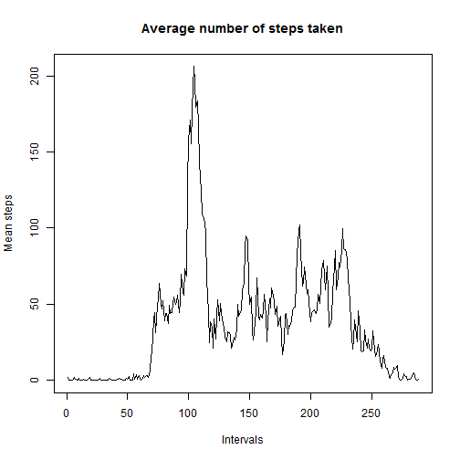
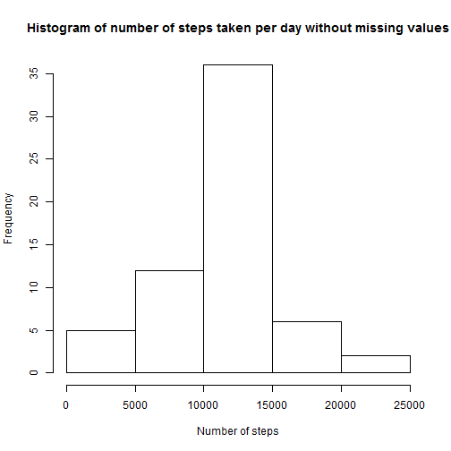
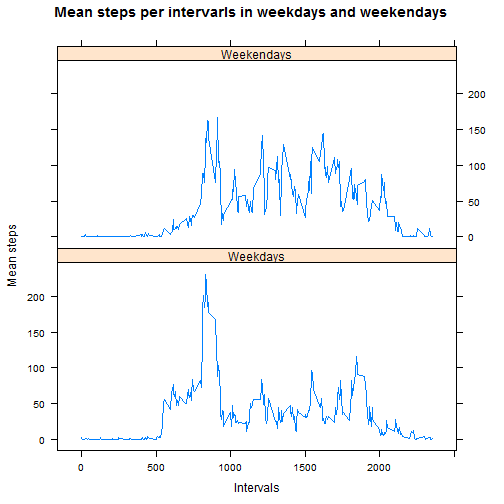

## Loading and preprocessing the data

Load the data (i.e. read.csv())

Process/transform the data (if necessary) into a format suitable for your analysis.


```r
## Read data
data <- read.csv('./activity.csv')
## Sum of steps taken by day using tapply
sum_steps <- tapply(data$steps, data$date, sum)
```
## What is mean total number of steps taken per day?

For this part of the assignment, you can ignore the missing values in the dataset.

Make a histogram of the total number of steps taken each day.

Calculate and report the mean and median total number of steps taken per day.

 

The mean total number of steps taken per day is 1.0766189 &times; 10<sup>4</sup>, the standart deviation is 4269.1804927.

## What is the average daily activity pattern?

Make a time series plot (i.e. type = "l") of the 5-minute interval (x-axis) and the average number of steps taken, averaged across all days (y-axis)

Which 5-minute interval, on average across all the days in the dataset, contains the maximum number of steps?


```r
## What is the average daily activity pattern?
## Makes the mean steps taken in each interval
mean_steps <- tapply(data$steps, data$interval, mean, na.rm=TRUE)

## Plots this mean
plot(mean_steps, type='l', xlab = 'Intervals', ylab = 'Mean steps', 
     main='Average number of steps taken')
```

 

```r
## Looks for the 5 minutes interval in which de mean of steps is the highest
index <- which(mean_steps==max(mean_steps))
```

The 5-minute interval maximum number of steps on average across all the days is 104

## Imputing missing values

Note that there are a number of days/intervals where there are missing values (coded as NA). The presence of missing days may introduce bias into some calculations or summaries of the data.

Calculate and report the total number of missing values in the dataset (i.e. the total number of rows with NAs)

Devise a strategy for filling in all of the missing values in the dataset. The strategy does not need to be sophisticated. For example, you could use the mean/median for that day, or the mean for that 5-minute interval, etc.

Create a new dataset that is equal to the original dataset but with the missing data filled in.

Make a histogram of the total number of steps taken each day and Calculate and report the mean and median total number of steps taken per day. Do these values differ from the estimates from the first part of the assignment? What is the impact of imputing missing data on the estimates of the total daily number of steps?


```r
##########################
## Imputing missing values
## Looks for the position of the missing values
index_NA <- which(is.na(data$steps)==TRUE)

## Subtituing the values for the mean of steps
steps_missing_values <- rep(mean_steps,61)
data_clean <- data
data_clean$steps[index_NA] <- steps_missing_values[index_NA]

## Sums the steps per day in the new clean data
sum_steps_clean <- tapply(data_clean$steps, data_clean$date, sum)

## Makes the histogram of steps per day in the new clean data
hist(sum_steps_clean,main ='Histogram of number of steps taken per day without missing values',
     xlab='Number of steps')
```

 

```r
## Compute mean and standart deviation of steps per day in the new clean data
mean_steps_perday_clean <- mean(sum_steps_clean)
std_steps_perday_clean <- sd(sum_steps_clean)
```

I removed missing values using the function is.na and which. And I decided to fill up theses values with the mean for that 5-minute interval because I think is a good representation for them.

The mean steps per day without missing values is 1.0766189 &times; 10<sup>4</sup> and the standart deviation is 3974.390746. The mean is equal to the other one 1.0766189 &times; 10<sup>4</sup>, but standart deviation no, 4269.1804927. As we have used the mean steps per day to fill up the missing values, the mean remains respect of the old data with missing values.

## Are there differences in activity patterns between weekdays and weekends?

For this part the weekdays() function may be of some help here. Use the dataset with the filled-in missing values for this part.

Create a new factor variable in the dataset with two levels - "weekday" and "weekend" indicating whether a given date is a weekday or weekend day.

Make a panel plot containing a time series plot (i.e. type = "l") of the 5-minute interval (x-axis) and the average number of steps taken, averaged across all weekday days or weekend days (y-axis). See the README file in the GitHub repository to see an example of what this plot should look like using simulated data
    

```r
## Are there differences in activity patterns between weekdays and weekends?
library(lattice)

## Takes date variable as date format
fecha <- as.Date(data_clean$date)
## Use weekday function to difference each day
day <- weekdays(fecha)

## Clasify weekendays as 1 and weekday as 0
day[which(day=='domingo')]=1
day[which(day=='sábado')]=1
day[which(day!=1)]=0

## Transform new variable date as numeric and add the 
## new variable in the column
day <- as.numeric(day)
newdata <- cbind(data_clean, day)

## Choose different data sets depend on day variable
data_weekenday <- newdata[which(newdata$day==1), ]
data_weekday <- newdata[which(newdata$day==0), ]

## Compute the mean per interval of these two new data sets
mean_steps_weekenday <- tapply(data_weekenday$steps,data_weekenday$interval, mean)
mean_steps_weekday <- tapply(data_weekday$steps,data_weekday$interval, mean)

## Plot mean steps per interval in weekdays and weekendays
dat <- rbind(data.frame(steps=mean_steps_weekday,
                        interval=unique(newdata$interval),day=0), 
             data.frame(steps=mean_steps_weekenday,
                        interval=unique(newdata$interval),day=1))
day.f<-factor(dat$day,levels=c(0,1),
               labels=c("Weekdays","Weekendays")) 
xyplot(steps~interval|day.f, data=dat,type='l',
       main="Mean steps per intervarls in weekdays and weekendays",
       xlab="Intervals", ylab= 'Mean steps', layout=c(1,2))
```

 

As we can see in the plot the curve of weekdays is different from the other one. Therefore, we can conclude there are differences between them.
